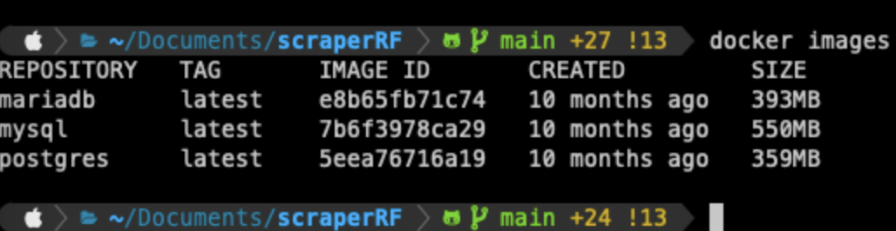
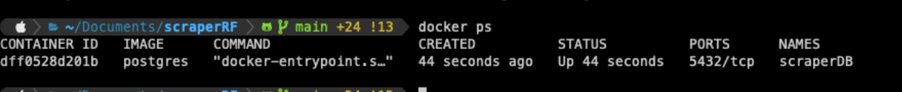
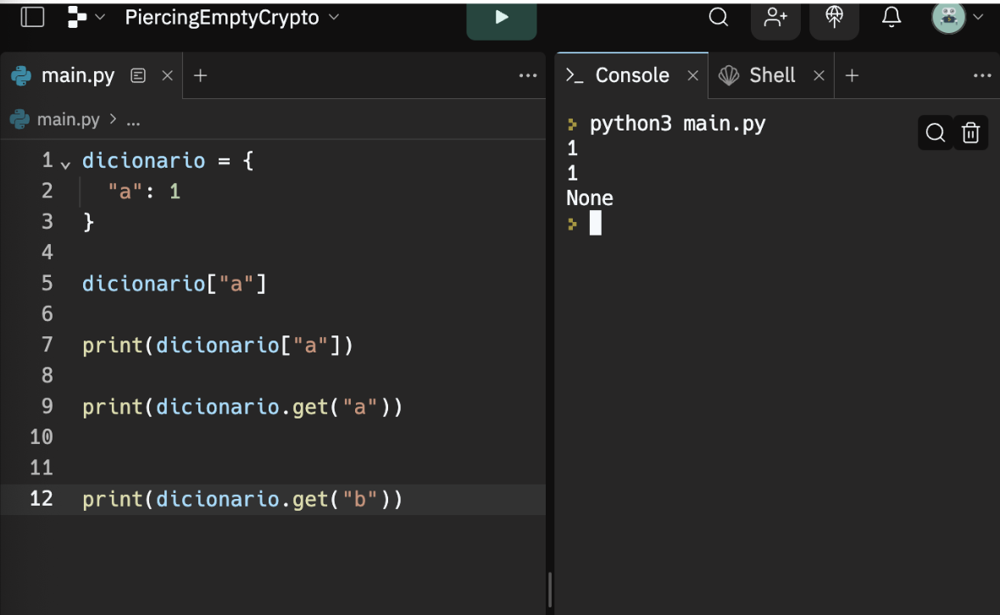
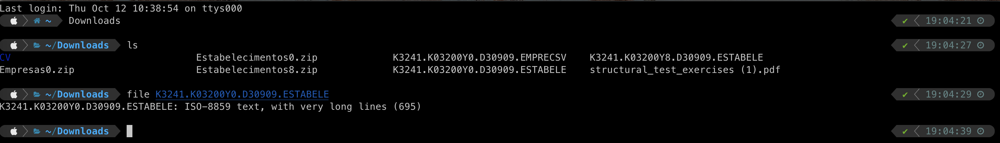

# Anotações 

Esse documento é para auxiliar o entendimento das tomadas de decisões.

## Por que Postgresql? 

- É OpenSource e pode ser utilizado comerciamente sem lincença
- É um banco de dados DB relacional (SQL) maduro, utilizada por várias empresas de escala (Uber, por exemplo)
- É suportado pelas maiorias de serviço de cloud
- Enterprises: larga escala, com grandes proporções mercadológicas
- Tamanho da base de dados [ilimitado](https://www.postgresql.org/docs/current/limits.html)


## Configurando o ambiente virtual Python:

```sh
python3 -m venv venv
```

## Por que usamos o docker? 

Porque usar o docker: ele vai uniformizar o ambiente de desenvolvimento. (Sem diferença de sistema operacional)
"Em resumo, rodar aplicações no Docker permite a criação de ambientes controlados para extrair o máximo do 
desenvolvimento de software, independentemente do tamanho do sistema criado." [Blog logap](https://logap.com.br/blog/o-que-e-docker/#:~:text=A%20grande%20diferen%C3%A7a%20%E2%80%94%20e%20vantagem,bem%20popular%20nos%20dias%20atuais.)

Passo a passo do docker:

1) Como executar o container do postgres: https://hub.docker.com/_/postgres 

``` sh
docker run -d \
   --rm \
  --name scraperDb \
  -e POSTGRES_PASSWORD=scraper \
   -e POSTGRES_USER=scraper \
   -e POSTGRES_DB=scraperDB \
   -e PGDATA=/var/lib/postgresql/data/pgdata \
   -v pgdata:/var/lib/postgresql/data \
   -p 5432:5432 \
   postgres
```
Para visualizar as imagens docker disponíveis na sua máquina:


```sh
docker images
```
2) Listando serviços do docker para ver se o comando para rodar o postgres:



3) Como parar o seerviço do banco? 

```sh
docker stop <container-id>
```
Observações do DB: 
Nome database: scraperDB

Para cada index (Empresas, Estabelecimentos, Cnaes, Motivos, Municipios..) precisaremos dar um `CREATE TABLE` diferente,
as colunas são diferentes entre elas.


## Por que usar migrations
"Migrations são uma forma de gerenciar as mudanças na estrutura do banco de dados de uma aplicação. Eles permitem 
que você crie, altere ou exclua tabelas, colunas, índices e outros elementos do banco de dados de forma consistente e 
controlada.", [Kenzie](https://kenzie.com.br/blog/migrations/)

Primeiro instalar yoyo migrations, uma biblioteca de migration:
[yoyo migrations](https://ollycope.com/software/yoyo/latest/)

Yoyo permite escrever scripts de migração em SQL bruto ou Python contendo instruções SQL para migrar 
seu esquema de banco de dados para uma nova versão.

## Uso de dicionários

Uso de dicionários em python:

Forma de coleção de dados em que se guarda uma chave e um valor correspondente. 



No momento estamos usando o dicionário para representar as entidades do sistema.
Também nossas funções de banco de dados receber e retornam dicionários.

## IDE para visualização da database

[pgAdmin](https://www.pgadmin.org/download/) é a principal ferramenta de gerenciamento de código aberto para Postgres. 
O pgAdmin 4 foi projetado para atender às necessidades de usuários iniciantes e experientes do Postgres, 
fornecendo uma interface gráfica poderosa que simplifica a criação, manutenção e uso de objetos de banco de dados.

## Como identifiquei o encoding do arquivo csv? 

Por linha de comando shell:

1) Vá até o diretório que está o arquivo
2) Utiliza o comando `ls` para visualizar as pastas disponíveis nesse diretório
3) Utilize o comando `file`:
```sh
file <nome_arquivo.extencao>
```



## Transactions em SQL

Um grupo de comandos que alteram os dados armazenados em um banco de dados e uma transação é 
tratada como uma única unidade, portanto esta transação basicamente garante que todos esses comandos sejam executados 
com sucesso ou nenhum deles. Elas garantem a integridade do banco de dados. 

## Cloud 

Google cloud, Azure, AWS. 

### TODO
- [x] Fazer estrutura de banco de dados
- [x] Criar um ambiente virtual env
- [x] Quebrar a main em vários arquivos
- [x] Fazer função que insere endereco no banco
- [x] Fazer função que insere estabelecimento no banco
- [x] Fazer o enconding do csv ser autodetectado
- [x] Criar conexão com o banco de dados python -> postgresql
- [ ] Deixar a função que lê csv mais genérica, para atender as outras tables 
- [ ] Fazer o webscraping para pegar as outras tables (eu vi que as informações estão tabeladas)
- [x] Fazer os outros CREATE TABLES
- [x] As funções de CREATE precisam retornar o id
- [ ] Fazer em orientação a objeto
- [ ] Suporte para CLI
- [ ] Tratar erros (try except, implementar transactions)
- [ ] Mover configuração de banco da dados para variável de ambiente (informações de senha, usúario, host, porta...)

#### TODO PARA AMANHÃ
- [x] Transactions
- [ ] fazer o scraper
- [ ] fazer a função rodar para todos os estabelecimentos
- [ ] fazer a generalização da função process_csv


### Temas para estudo
- [x] Docker
- [x] Migrations
- [ ] Debug em python
- [x] SQL Transactions
Preciso colocar a create endereco e estabelecimento na mesma transacao
- [ ] Tabela espelho (para criar histórico de informações)


### Tempo de carregamento
Questão de tempo de importar o csv para o postgres que podemos pensar:
Um cvs de tamanho 328M demorou por volta de 50 minutos para rodar. (Referência minha máquina)
- Será que vale a pena mudar o auto-commit na função de conexão com o banco de dados?
- Será que vale a pena fazer rodar em disco em vez de uma pasta temporária?

Talvez utilizando transactions ficará mais rápido sem mais modificações


## Mais referências que eu utilizei para o código

[Manipulando dados em postgresql](https://dadosaocubo.com/manipulando-dados-em-postgresql-com-python/) acesso em 01/10/2023

[Solução de problemas com o pacote psycopg3](https://stackoverflow.com/questions/75534231/how-can-i-connect-to-remote-database-using-psycopg3) acesso em 12/10/2023

[Documentação](https://www.psycopg.org/psycopg3/docs/basic/params.html) acesso em 12/10/2023

